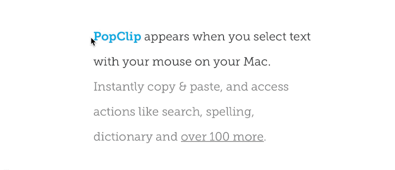

  
  <h1 align="center">Google Translate PopClip Extension</h1>
  

    Instant Google Translate for PopClip
     
    <a href="https://pilotmoon.com/popclip">https://pilotmoon.com/popclip</a>
  

  <h3 align="center">Installation</h3>
  

    Download this repo → Open <strong>Google-Translate.popclipext</strong> → Install "Google Translate".
     
     
    If it's helpful, please 🌟 this repo. Thank you!
  

